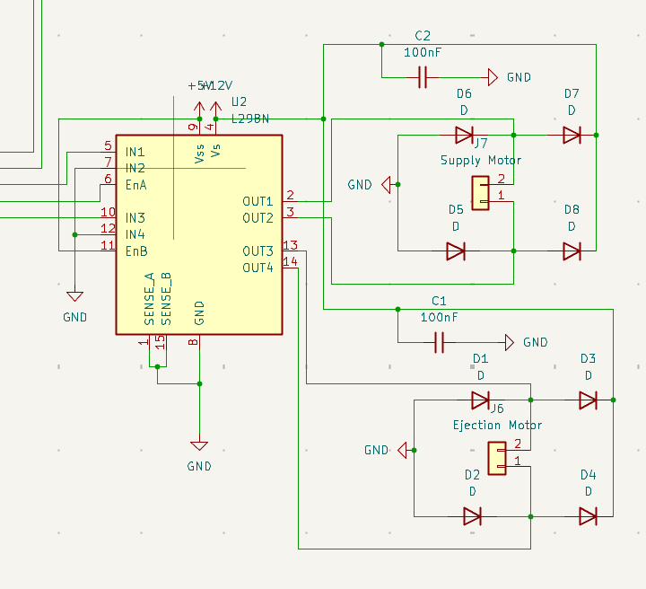
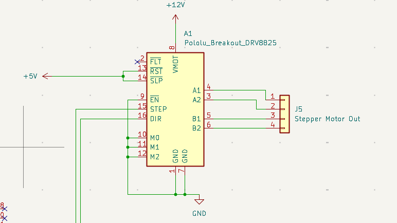
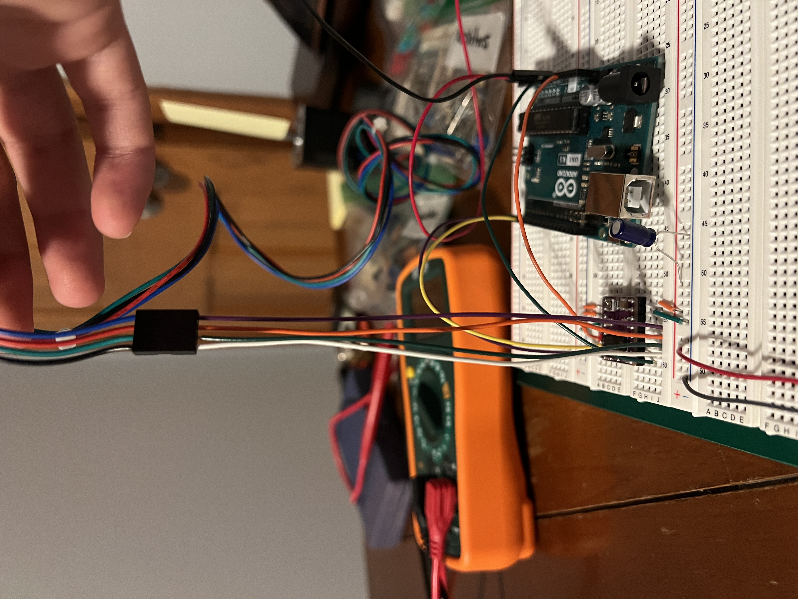

# Daniel Gutierrez (danielg9, 669537203) Worklog

## February 17th, 2025
**Objective: Prepare for Project Proposal**

Longer meeting today with Matt. We had a few things that we had to accomplish to feel prepared for our project proposal tomorrow:
- Finish our block diagram (had a few mistakes left from our last meeting)
- Figure out a meeting schedule with each other and Gregg
- Start the research process for our parts
- Created our tolerance analysis for our proposal
- Drew up a software FSM for our machine
- Write the high-level requirements and subsystem descriptions
- Write the Ethics and Safety in our document

## February 23rd, 2025
**Objective: Research different parts**

I am meeting with Matt to work on the schematic together for each of our separate subsystems. Researching different components and reading the datasheet to make sure that they were compatible with our microcontroller. We have a few questions on the power subsystem and how we can order parts from Jason that we are hoping to get answered from Jason.
## February 24th, 2025
**Objective: Finish schematic for Ejection and Swivel Subsystem**

Matt and I decided to use KiCad for our schematic. For the motor drivers, we needed to implement this on our PCB. The data sheets were very helpful in creating a schematic in KiCad.

[L298N Chip Datasheet](https://www.st.com/resource/en/datasheet/l298.pdf)

[DRV8825 Chip Datasheet](https://www.ti.com/lit/ds/symlink/drv8825.pdf)

Implementing the information from the datasheet to our L298N schematic:

Implementing the information from the datasheet to our DRV8825 schematic:

## February 26nd, 2025
**Objective: Order parts**

Meeting with Matt to finalize the parts that were needed for our breadboard demo. You might have noticed that I didn't buy any DC motors, this is because I had some leftover DC motors from ECE110 that I'm going to test out first before buying some actual high-powered motors. Here are the links to the parts that I will be using for the Ejection and Swivel subsystems:

[Microcontroller (ESP32-S3)](https://www.amazon.com/YEJMKJ-Development-ESP32-S3-DevKitC-1-N16R8-ESP32-S3-WROOM-1-Microcontroller/dp/B0CRRNLTPD/)

[Stepper Motor](https://www.amazon.com/STEPPERONLINE-Stepper-Bipolar-Connector-compatible/dp/B00PNEQKC0/)

[Stepper Motor Driver](https://www.amazon.com/WWZMDiB-DRV8825-Different-Resolutions-StepStick/dp/B0C6P9BCLV/)

[DC Motor Driver](https://www.amazon.com/WWZMDiB-L298N-H-Bridge-Controller-Raspberry/dp/B0CR6BX5QL/)

## March 1st, 2025
**Objective: Get familiar with the order parts and start testing different motor speeds**

Now that the motor drivers were in, I was finally able to get my hands dirty with testing. I haven't worked with drivers before so the only goal for today was to see if I can them them running with the limited supply of voltage. The batteries didn't have the voltage required and the external car battery didn't have the required current to produce motor speed. I was able to debug this with the Nema 17 stepper motor and the DRV8825 driver. You can hear the gears humming inside, but it couldn't spin.

## March 7th, 2025
**Prepare for the breadboard demo**

We finally got all our parts in for our breadboard demo. We wanted to ensure we had enough time to work on our respective modules and then come together to put all our pieces together. We decided that we wanted to show that our motors and the TOF sensor were working. 

## March 13th, 2025
**Objective: Talk with the Machine Shop mechanics about our design**

We have been in contact with the Machine Shop mechanics for most of the semester so far. However, we finalized the design today and provided them with all of the relevant information that they needed to start working on the project during spring break. The only thing that we didn't give them was the PCB dimensions. This is because we haven't finalized the PCB just yet so we needed more time to work on the exact dimensions.

## March 29st
**Objective: Work on the PCB design**

Today's objective was to finish the PCB design and get that ordered into the 3rd wave. There was still some issues with ERC and DRC that we haven't quite fixed yet. We still have to do more research on how to program the ESP32 and what exact the purpose of data lines are in PCBway.

## March 30th
**Objective: Finish the PCB design and order the parts**

After doing some more research, we finally finished the PCB design and got that submitted to Jason so that he could order for the 3rd wave. The biggest problem for us was solving for the power connections. We were getting many errors about this and after doing some research, it looked like the issue was putting some PWR flags into our design. We're still not exactly sure why this works, but this is what made the majority of the errors go away. Something that we are still worried about is our connection lines. Because we are using a lot of different current values in our PCB, we needed many different line widths, so we are hoping we got it correct after double-checking everything.

## April 9th
**Objective: Solder on the PCB**

Now that we got all the parts plus the PCB order in, I spent the majority of the day trying to solder on the entire PCB. Everything was going great, except that I found out that one of the parts that we ordered for the PCB had the wrong footprint on the PCB. This meant that we needed to do some extra wiring on the PCB to make it work. This wasn't too much of an issue, it just sucked because the last deadline for the PCB wave 4 already passed so it may made the PCB look a little less put together with the extra wiring. I tested the PCB when everything was all soldered on and it didn't work, I left for the debugging another day. 

## April 12th
**Objective: Fixed the power issues**

I spent the next couple of days trying to figure out what the issue was with the PCB. Based on what I've been seeing, it seems like there is a missing ground connection somewhere on the board. I was pretty upset with the current board we have on now, so I decided that I was going to disassemble the current PCB, try to salvage the parts, and then resolder it onto a new board. The difference is that I am going to test every connection as I go so that I know for sure that everything is correctly placed before I plug it into power. I spent a couple of hours doing that and when I finished and plugged it in, we got the LEDs to light up which means that we have all the necessary voltages correct.

## April 23st
**Objective: Flash memory to the ESP32**

I had to solder the ESP32 chip a few times onto the PCB before this finally worked. We wanted to get a simple blinking LED to work on the chip before we programmed anything else. After a few tries and making sure that we had solid connections from the USBC to the ESP32, we got a blinking LED to show on our PCB. This is a pretty big weight off our shoulders because we needed to know quickly if we needed to purchase another board before the final demo. 

## April 26th
**Objective: Putting everyting into our PCB**

Now that we have all of our modules working, it is time to put everything onto our PCB so that we can test everything together. A lot of micro-testing of all of our motors so that they work in combination with everything. This involved more or less steps for each of the stepper motors and changing how fast the stepper motors would go. We found after extensive testing that the stepper motor needed to go quicker and the swivel motor needed to spin a lot slower since the swivel motor is carrying a lot more weight. Something that we couldn't get quite right was the TOF sensor, while it was working during the breadboard and the mock demo, we couldn't quite get it to work during the final demo for some unknown reason.
