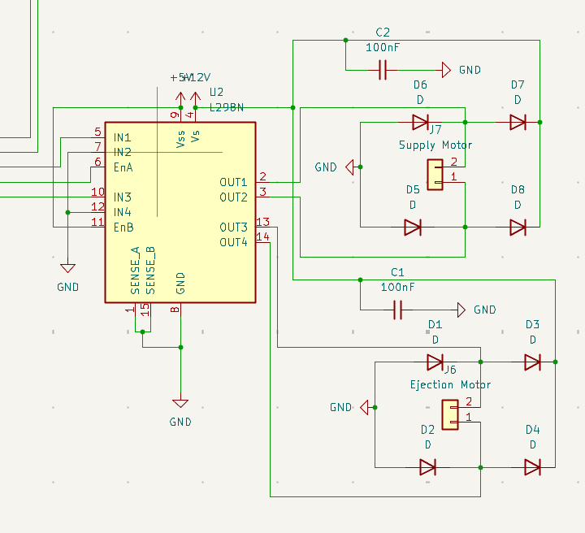
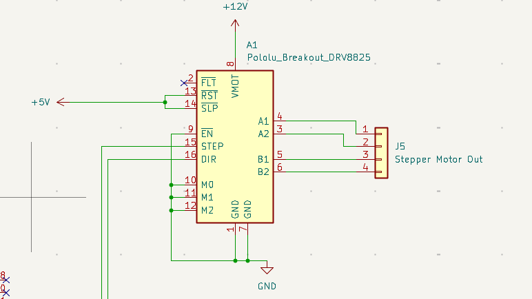
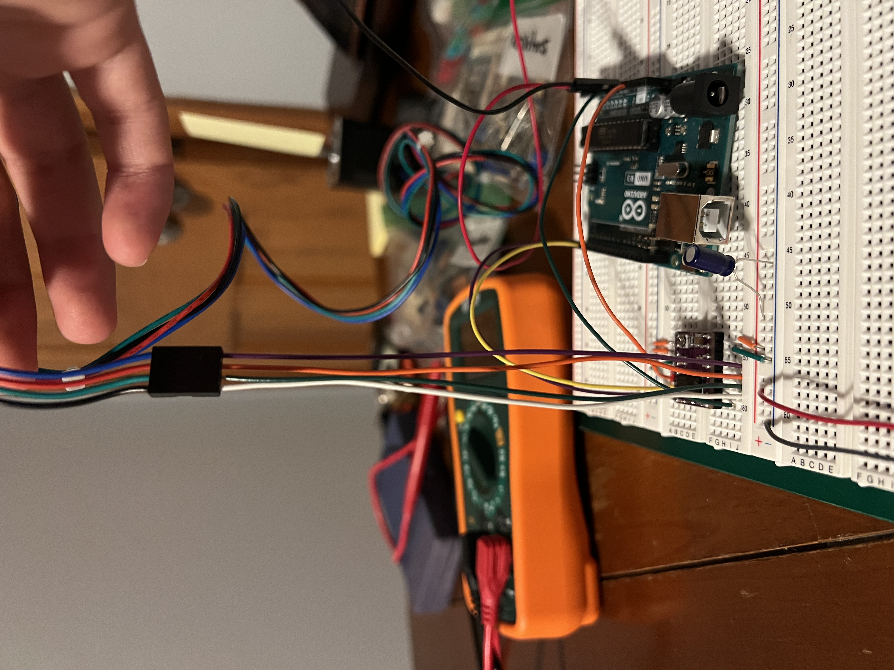

# Daniel Gutierrez (danielg9, 669537203) Worklog

## February 17th, 2025
**Objective: Prepare for Project Proposal**

Longer meeting today with Matt. We had a few things that we had to accomplish to feel prepared for our project proposal tomorrow:
- Finish our block diagram (had a few mistakes left from our last meeting)
- Figure out a meeting schedule with each other and Gregg
- Start the research process for our parts
- Created our tolerance analysis for our proposal
- Drew up a software FSM for our machine
- Write the high-level requirements and subsystem descriptions
- Write the Ethics and Safety in our document

## February 23rd, 2025
**Objective: Research different parts**

I am meeting with Matt to work on the schematic together for each of our separate subsystems. Researching different components and reading the datasheet to make sure that they were compatible with our microcontroller. We have a few questions on the power subsystem and how we can order parts from Jason that we are hoping to get answered from Jason.
## February 24th, 2025
**Objective: Finish schematic for Ejection and Swivel Subsystem**

Matt and I decided to use KiCad for our schematic. For the motor drivers, we needed to implement this on our PCB. The data sheets were very helpful in creating a schematic in KiCad.

[L298N Chip Datasheet](https://www.st.com/resource/en/datasheet/l298.pdf)

[DRV8825 Chip Datasheet](https://www.ti.com/lit/ds/symlink/drv8825.pdf)

Implementing the information from the datasheet to our schematic:

## February 26nd, 2025
**Objective: Order parts**

Meeting with Matt to finalize the parts that were needed for our breadboard demo. You might have noticed that I didn't buy any DC motors, this is because I had some leftover DC motors from ECE110 that I'm going to test out first before buying some actual high-powered motors. Here are the links to the parts that I will be using for the Ejection and Swivel subsystems:

[Microcontroller (ESP32-S3)](https://www.amazon.com/YEJMKJ-Development-ESP32-S3-DevKitC-1-N16R8-ESP32-S3-WROOM-1-Microcontroller/dp/B0CRRNLTPD/)

[Stepper Motor](https://www.amazon.com/STEPPERONLINE-Stepper-Bipolar-Connector-compatible/dp/B00PNEQKC0/)

[Stepper Motor Driver](https://www.amazon.com/WWZMDiB-DRV8825-Different-Resolutions-StepStick/dp/B0C6P9BCLV/)

[DC Motor Driver](https://www.amazon.com/WWZMDiB-L298N-H-Bridge-Controller-Raspberry/dp/B0CR6BX5QL/)

## March 1st, 2025
**Objective: Get familiar with the order parts and start testing different motor speeds**

Now that the motor drivers were in, I was finally able to get my hands dirty with testing. I haven't worked with drivers before so the only goal for today was to see if I can them them running with the limited supply of voltage. The batteries didn't have the voltage required and the external car battery didn't have the required current to produce motor speed. I was able to debug this with the Nema 17 stepper motor and the DRV8825 driver. You can hear the gears humming inside, but it couldn't spin.

