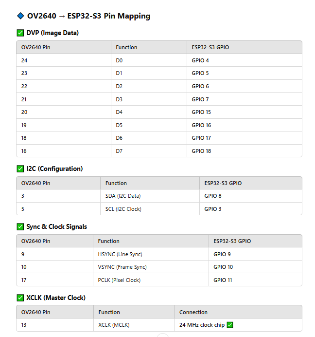

  

# Matthew Tzeng (mttzeng2, 668326215) Worklog

### **2/17/24: Worked on Creating our Project Proposal**
Worked with Danny to create and review our project proposal. We decided the basic layout of our design and the necessary modules and parts required to have our card dealer work. We also discussed the memory limitations of the ESP32-S3 when it came to image processing, and solutions for the issue

Our solution included the following
- Preprocess images so that the microcontroller will have less to process, saving memory
- Reduce the amount of pixels required for the front facing camera to only include the middle vertical 1/3 strip, as the left and right image data isn't required for the needs of the front facing camera (person detection)

### **2/19/24: Finding Compatible Parts (Camera Module)**

Looked into camera module parts for breadboard demo

  

**TOF10120 Distance Sensor \[[Link](https://www.amazon.com/HUABAN-TOF10120-Flight-Distance-Measuring/dp/B089SLWYZ9)\]**

- Able to sense distance from 5-180cm

- UART interface (works well with ESP32)

  

**OV2640 Camera \[[Link](https://www.amazon.com/FORIOT-160%C2%B0I2C-Wide-Angle-Megapixel-Support/dp/B0CJTNMXXF?crid=16GO757L87GEY&dib=eyJ2IjoiMSJ9.VAPdNR6AhUwajSD1-c8640rCYcfi4aIlIy5JA0B8H9hrbjvv2HHuAkLVu5IG3L6mVJAbinlTbEveBPrU3Ry7V3z5vj_wedqd0HloyFT3cYvDIAsfa7ImFoZkwY_6OTf2buawd7tlji2cseHQ_sv6VP4uh3wL4xyb7cunhBGpTti8YK2bQZN7bm6aHhqtMASnnnGI2s3DUEu-gmAgMtKT3XBpgIaOz1i1P-SANH0gvu5tggVyINBpIOFS0ot4tPVsGQGVVx1O1oF9oeTm6OnbsOtIhX2v--ePEBteaT4Z7XXSj0vxHqn0J8SUBCqYagWirHWFAMG2oWTgGmekEWLAm8B3eK74JUSikbCUx0DAguw.kKNsyZQ7h07s_YDiGwuIJRy_LRNTWK70FV4P8Am_6i0&dib_tag=se&keywords=ov2640&qid=1740619820&s=electronics&sprefix=ov2640%2Celectronics%2C113&sr=1-4&th=1)\]**

- 160 degree wide angle lens (good for up close card)

- 24 pin adapter

- Provides pinouts for specific model

  

**USB Camera Module \[[Link](https://www.amazon.com/Camera-Module-W202012HD-Compatible-Computer/dp/B0B78LHKPG?crid=3G7LJH8YKHWZL&dib=eyJ2IjoiMSJ9.FVVlnFujs4LI5Ro7zd7O-xBIGWeNg9w6kl3cWi-viThUx4Olhl65Qiw1T6ABograkvnSwIjJ1moGTK0J90LyqTyDvitwHyNg_jJnKe5Jd_f-Ifelz-yeLSr1AOia62L02x0SUMsP0lAiVo8cDVE9JmzmneXn_5dp1vu3Vz5BwkONRGwvY4i1tx3cL7Cg5Xe64xx-0WNxcRCqXsSvOPQa_koTOgczfeTMbujDYlImghnXR9JYfuIChSHv00zhXzI6OeJhrkMmjea9eHChC6-Ox6ExaKNBev_-IJmc-jmqgVQS5v5iuB2Dv8wGsMHUqG_mMQIXXKJjiMf_y_KCPjG75MXRAOJOhG-vfCeSqikdq58.-EXYxZJ_KwLhN7BNXfcYO3mMSVLxy__3YbJ05BFIE5w&dib_tag=se&keywords=usb+camera+module+ov2640&qid=1740623914&s=electronics&sprefix=usb+camera+module+ov2640%2Celectronics%2C104&sr=1-30&xpid=_GWS3coQVN7Fp)\]**

  

  

- Uses UART protocol (only requires two GPIO pins)

- Ideally used for front facing camera (towards player)

##

  

## **2/24/24: Planning GPIO Pin Routing for Camera Module**

### Resources utilized for today

- [OV2640 Datasheet](https://www.mpja.com/download/ov2640data%20sheet.pdf)

- 
- Decided that D0-7 will be connected to GPIO pins in range of 6-16 (High Speed)
- 
- Pinout of the OV2640 connected to the GPIO pins of the ESP32
- 

## **2/26/24: Ordered Parts For Project With Danny**
Danny and I discussed which parts we're necessary for the project, and we ended up ordering all the parts required for the breadboard demo on Amazon. These parts included
- Stepper Motor
- Stepper Motor Driver
- DC Motor Driver (We already have 2 DC Motors)

- ESP32-S3 Dev Board (x2)
    - Helpful for us both if we can each have a dev board to work on seperate modules concurrently
- OV2640 Camera (x3)
    - Came in pack of 3
- FFC 24-pin connector 0.5mm
    - For the OV2640 camera to connect to breadboard
- TOF10120 Distance Sensor
- USB 1MP Camera
- USB-A Breakout Board (Female)

With these parts, we should be able to complete the breadboard demo section of this project.

## **3/3/24: Reconviened With Danny with Physical Parts**

Discussed the parts we ordered from Amazon. 

We also worked on the power subsystem in the schematic

We decided, as per our TA Jason's advice, to use a Switching Regulator when it came to converting from 12V to 5V, and to use a LDO when moving from 5V to 3.3V.

We also added to our schematic the "Power-In" input, which will support a 12V 6A power supply. We'll plan on testing this on the oscilliscope first, and once we get the successful specs for our power, we'll purchase a power supply then.

[Switching Regulator Resource](https://www.circuitstune.com/2011/12/12-to-5-volt-dc-dc-converter-circuit.html)

[LDO Resource](https://www.electronics-lab.com/project/3-3v-voltage-regulator/)

## **3/4/24: Working on Setting up Arduino IDE Envirnoment for ESP32-S3 Dev Kit**

Notes for TOF10120:
- Do NOT use RX and TX ports on the dev board
    - Not sure why, but inputs dont work and i cant read data. use the other GPIO pins instead
    - Used 18 and 8 and it worked
- Use 3.3V or 5V either works
- Use Right USB Port (works better)

## **3/5/24: Setting up the OV2640 using the FPC-24P breakout board**
**PINOUT**
| Pin # | Name | Function
| -------- | ------- | ------- |
| 1 | NC | idk |
| 2 | AGND | idk |
| 3 | SDA | idk |
| 4 | AVDD | Use 3.3V |
| 5 | SCL | idk |
| 6 | RESET | idk |
| 7 | VS | idk |
| 8 | PWON | idk |
| 9 | HS | idk |
| 10 | DVDD1.2 | Internally Regulated (Checked with Multimeter) no pin |
| 11 | DOVDD2.8 | Use 3.3V |
| 12 | D9 | idk |
| 13 | MCLK | idk |
| 14 | D8 | idk |
| 15 | DGND | idk |
| 16 | D7 | idk |
| 17 | PCLK | idk |
| 18 | D6 | idk |
| 19 | D2 | idk |
| 20 | D5 | idk |
| 21 | D3 | idk |
| 22 | D4 | idk |
| 23 | D1 | idk |
| 24 | D0 | idk |

** CANNOT USE GPIO10 FOR OUTPUT!!! Reserved for FLASH PSRAM OPERATIONS **

MAKE SURE TO ENABLE PSRAM (TOOLS -> PSRAM -> QSPI) [DONT DO THIS ACTUALLY]
psych my dev board doesn't have psram wow what an L

what currently "works"
#define XCLK_PIN 21  // GPIO for XCLK (MCLK)

// GPIO Pin Mapping (Use your setup)
#define PWDN_GPIO_NUM    -1
#define RESET_GPIO_NUM    12
#define XCLK_GPIO_NUM     21
#define SIOD_GPIO_NUM     8
#define SIOC_GPIO_NUM     9

#define Y7_GPIO_NUM       18
#define Y6_GPIO_NUM       17
#define Y5_GPIO_NUM       16
#define Y4_GPIO_NUM       15
#define Y3_GPIO_NUM        7
#define Y2_GPIO_NUM        6
#define Y1_GPIO_NUM        5
#define Y0_GPIO_NUM        4
#define VSYNC_GPIO_NUM    13 // CHANGE FROM 10 DUE TO PSRAM STUFF
#define HREF_GPIO_NUM      9
#define PCLK_GPIO_NUM     11

#### DO THIS IN PLATFORMIO!!! (but for the N16R8)
Also... I'm using PlatformIO through VSCode now since it's just better and that's what the guide told me to do
https://community.platformio.org/t/issue-in-esp32-s3-wroom-1-n8r8-psram-initialization/40915
this is a lifesaver (wasted 5 hours on this one dumb but crucial issue)

## **3/8-10/24: Breadboard Demo Prep**
Worked on the breadboard demo for the weekend.
We came up with a design of a wheel with our motor attached to it. This is attached to a cardboard arm which we lower onto a card.
There's a tiny slit in the cardboard that sits in front of the card which it slides through as the motor launches it.

We integrated the TOF sensor (distance sensor) into the breadboard demo, with the distance sensor changing how fast the DC motor would spin.
This is basically how our final design will work, but with a lot more sophisticaion.

The code we wrote adjusts the time between steps based on the distance the TOF sensor was detecting.
We used a Map to map our distance range to the powers we found worked best for the range. Power went from 75-150, and distance was 1 foot to 6 feet.

We also made a quick demo for the swivel motor, showing how it could turn 45 degrees at a time to service 8 people, and then turn back to its original position the other way.
We did this since our power cord is gonna be externally connected in the final design, so it needs to turn back in order for it not to get tangled.

Update: Breadboard demo went well. Danny and I are working on getting sketches to Greg at the Machine Shop so they can start working on our design during Spring Break.

Update 2: We submitted our design and our parts (TOF sensor, Cameras). Still haven't gotten Greg the specs for the PCB. We decided we're gonna finish that after break and catch the third wave of PCB orders.

## **3/28-31/24: PCB work**
Worked with Danny to revamp our PCB
Danny did a lot of the PCB work, but I had to jump in at the end to add a few more LDO's for my camera (5->2.8V, 5->1.2V).
After those were fixed, we submitted that gerber file.
Got in the third pcb order wave. I thought there we're five order waves, but there's only four. I don't think we're getting another PCB.
Because of that, we just added a bumch of extra connectors to connect to the GPIOs of our ESP since I don't know exactly which ones I need for the camera yet
I hate this camera so much.

Also, Paul finished with the machine shop build. Gonna check it out later.

## **4/6-10/24: Wi-Fi i hate wifi i hate it so much**
### I figured out the Wi-Fi, and I'm a dumbass
I've been stuck on the wifi being inconsistent, to the point of basically being unusable (both connecting to a router and hosting an AP) for days now.
Turns out, after finding a reddit post, that all I had to do was take the ESP32 devboard OFF the breadboard.
The antenna works best when it's not up against a surface. I wasted like 3 days on this.

### I'm a dumbass.

Was able to get the chip connected to my home wifi, and have a webpage show on the router at 192.168.10.226. Super hyped since it resets really fast when I upload updates, so testing this should be easy.
Also, AP mode works, where I can connect my phone to the esp32 iteself. Doesn't provide internet for my phone, but I can access the page that it hosts which is all I need.
Doesn't connect to IllinoisNet though, so I'm planning on working on the webserver mostly at home since debugging is a lot faster. I hate changing my wifi on my computer everytime I change a single line of code to test.

## **4/14-15/24: Converting Python Card Detection to Javascript**
Because I had already written my Card Detection code in python successfully, I needed to now transfer it into JS. Originally I was thinking I could use a Raspberry Pi to run my code, but since we can't, I need a way to load this code onto the esp32 and have it run on client devices since the esp32 can't process the images fast enough locally. The idea is to upload the card images to client devices (in a private page) and process it there and send the results back to the controller.
I used GPT to help convert my existing code into JS, using the OpenCV.js library. After tweaking and correcting some bugs, it worked honestly even better than the python code, with it being much more streamlined. Working with JS was really nice since I'm familiar with that language.

The problem with the OpenCV.js library is it's 8MB large, which is the same size as my flash memory on the ESP32-S3 chip we're using.

I was suggested to rebuild the OpenCV.js library using a JS builder called Emscripten. I spent hours trying to build that thing with only the "core" and "imgproc" parts of the library (since that's all I needed for the card detection) but after hours of trial and building and incompatability, I gave up.

I resorted to my second option, which was calling the actual JS library from the web, with the caveat being that the ESP32 could not work solely in AP mode, as it needed internet access. I would have to have it in AP_STA mode which allows internet connection as well as web server host. With that, I ended my work. I'll upload that image processing code once I get the camera working better with the detector.

## **4/18-20/24: Trying to get camera working**
Attempted a really jank setup which involved my lamp at a sideways angle, camera posted overhead on a box, facing downwards at a card. After hours of tweaking, finally got a good picture or two that could be recognized by the card detection program I wrote earlier (also changed a few parameters in the detection program to fit the needs of the picture I got). 

The image looks terrible, but it's the best image I was able to get out of this terrible terrible terrible camera over the like probably 80 hours I spent trying to get this damn thing to work.
With the image, I got some good deteciton results, with the template matching able to identify the image after a bit of processing.

Pretty cool results, and after all the work I had done this is nice.

Some of the parameters I had to change in my code itself were the height, area, and aspect ratio of the bounding boxes for these contours (suit and rank). These parameters are meant to ofc filter out unwanted contours and keep only the ones which are sized like the Rank and Suit of the card image (ideally only 1 of each contour since my code breaks if there's 2). So after looking through the images in an image editor to find the areas and heights of the boxes, I tweaked my settings and it worked great.

Regarding the actual physical build, we checked out the build and it looked good. However, the TOF sensor was a bit receeded into the wall of the machine, and the distances that showed up were maxing out around 2 feet (supposed to max out around 6 feet). Also, the camera bay had the camera RIGHT UP against the card, so it was dark. Also, only the rank was showing, not the suit. We need a bigger cutout for the rank and suit corner of the card, as well as space for some light. Need to get the camera working reliably first though.

## **4/21/24: Game State Flow for Website**
Poker is the main game which is going to be demoed on the machine, so in order to do that, I had to make a sort of state machine for the game of poker. It includes these phases

Waiting: Waiting for players to ready up
Preflop: Players are dealt their hands (sent to clients privately)
Flop: Three community cards are dealt to everyone
Turn: One more community card is dealt
River: Final community card is dealt
Showdown: Hands are revealed (in person not on the game client)
Reset: Community and player hand cards are reset, game commences once everyone is ready again.

I nested all these into a nextState() function which could be called to increment the state. Each state does specific things, which is nice since I can throw functions into each state based on what needs to be done.
For example, the Preflop stage, where players are dealt cards of their own, will have the machine deal cards to each player that is playing, and that will be a function I can just plop into that state so it happens. Once that's done, it sets the state to the Flop.
All the states have things like this, whether it's turning to players and dealing cards, or just resetting microcontroller memory.
Went ahead and prepared shell functions for things like the physical dealing of cards and rotations since I'm working at home and don't have access to our physical dealer atm. I'll fill those functions out later.

## **4/23/24-4/24/24: Websockets websockets websockets**
Learned all about websockets today. Used the AsyncWebSocket.h library to get websockets started.
Websockets were perfect for me, since they allowed me to update everyone connected to the esp as soon as the change happened on the microcontroller, instead of having clients poll for changes every few seconds.
I integrated websockets into the funcitonallity of many things, list below

Dealing New Hands
Dealing and displaying community cards
Updating the phase of games
Updating active player list for users
Updating ready status of players

On the note of players, I also added a systemt to uniquely identify players based on their inputted name, which got stored as local storage on their browser (like a cookie). If they decide to log back into the website (aka just visit it again), they don't have to put their name in, it automatically does it for them. I made a cool "Logged in as: ___" text at the top so they can see their name. 
There's also that player list which was mentioned earlier, which updates as soon as players join with their name, and also updates based on their ready status (toggleable). Games will only start once everyone's ready status is "ready".

## **4/25/24: Working on poker game with multiple users**
I worked on the poker game modurally from the actual camera. I developed a mock deck using code so I could simulate pulling cards from the deck. With that, I was able to use websockets to send poker information out to devices.

## **4/26/24-4/27/24: Hecticilly trying to integrate + fix everything**

### TOF Sensor
Finally got the TOF sensor integrated into the codebase in the lab
TOF data came from the RX TX wires (white and yellow on TOF10120), so transcribed those using a string buffer to get those working nicely. Then set up another server.on thing to host the distance as it's updated
Learned that you have to update the distance constantly or else the data gets backed up and you get bad old data.
Used websockets to connect the distance sensor data to the Wi-Fi web server (constantly updates)

### Motor Driver (DRV8825)
WHen working with the stepper motor driver, there were different settings for the queue and the swivel motor

#### Queue Motor Settings
Found it useful to keep queue motor settinsg at around 0.28-0.3A when running. It was able to handle slight weight with the full deck on top of it and was able to queue the full deck with no problem (the jams were in the ejection section in conjunction with the queue timing). The motor driver is assigned wires based on this for my specific NEMA motors

| Diagram Pin | Wire Color 
| -------- | -------
| B2 | Red
| B1 | Blue
| A1 | Green
| A2 | Black

Also, for stepper motors, it's sometimes not ideal to go straight into like full speed / power. Use gradually accel / deaccel graidents when starting up and slowing down steppers for more accuracy. I asked GPT to make some and they worked well.

For the rest of the wires, just follow the diagram online (POLOLU-2133.pdf). I hooked up the step and dir pins to my microcontroller so i could control those. Those you need to hook up since that's how you control it. ALSO disabling ENABLE pin will allow the wheel to spin freely, might be useful for preventing jams? idk.

#### Swivel Motor Settings
Swivel motor kind of worked? Needed more amperage for sure to get the heavy metal casing moving, but the DRV8825 gets WAY too hot (not safe gonna kill the chip type hot) so not sure what to do abt that. Will test later. ACCEL AND DECELL ARE SUPER IMPORTANT WITH HEAVY WORKING ONES LIKE THE SWIVEL.

### Card Ejection
Card ejection was super finicky when trialing a bunch of methods. The way I got it "working" was specific.
Set your power supply to like 3.5-4V for your ejection motor (that's a good range for like 1-6 feet of launch distance).
Then you power your queue motor as described above. For testing purposes, I just had the program run it at 3000 microsecond intervals
    digitalWrite(stepPin, HIGH);
    delayMicroseconds(3000); // Pulse HIGH for 1000 microseconds
    digitalWrite(stepPin, LOW);
    delayMicroseconds(3000); // Pulse LOW for 1000 microseconds
For the queue motor wheel which grabs the cards, I also put reverse sided tape (sticky side up) onto the wheel. At first, it would actualy queue the cards too fast, so I put at regular interfals downward facing tape to break up the stickieness. With that, the wheel almost "scooted" the cards forward at a pace where the ejection motor could recover speed from the previous ejection (prevent jams). In my testing, 3.5V launched aroudn like 1-4 feet, while 4 launched it the 6 foot distance.

## **4/28/24-4/29/24: Demo Preparation**
Finally soldered the PCB together, checking all the power lines to make sure it's good.
Ditched the OV2640 camera as it wasn't consistent enough with pictures. Opted to use a webcam instead.
With the image processing, decided to rewrite the code back into Python so it could be used on a Raspberry Pi instead of running on the client device.
Worked with Danny to get the motors working in conjuction with eachother.
Programmed a few different Demo actions for the machine:
    Rotate CW (would rotate the machine 90 degrees CW)
    Rotate CCW (would rotate the machine 90 degrees CCW)
    Rotate Reset (would rotate the machine 360 degrees CCW, and was meant as a way to show the reset functionallity of the machine during demo)
    Demo Eject (would start up the ejection motor at a set speed, then rotate the supply stepper motor to push card towards ejection motor, then would eject card)
With these demonstration buttons coded into the machine and the backend, we verified they worked for the demonstration.

Demo went well. We showed all the working parts we had prepared with minimal error. Happy with the results

## **4/30/24: Presentation Preparation**
We created the slide deck for the Casinova presentation, ahead of the Mock presentation deadline.
Provided a summary of our experience during the whole process, as well as details regarding each subsystem.

Update: Mock and Final Presentations went well.

## **5/5/24-5/7/24: Final Report**
Transfered a lot of our design document to the final report document. Worked on formatting everything correctly, as well as writing the abstract, detials about my own subsystems, and some concluding paragraphs. Danny fufilling his half. We're done with the Casinova for this semester.
